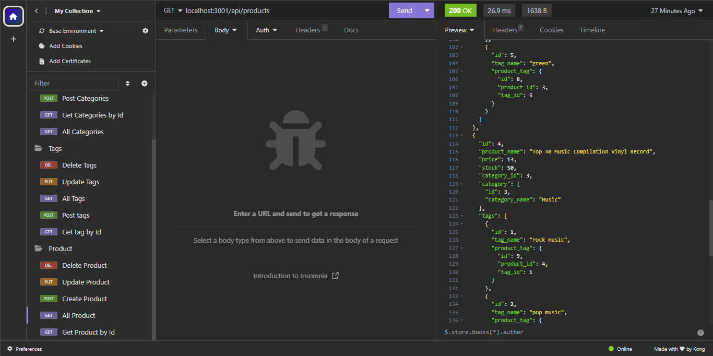

# -E-Commerce-Back-End

E-Commerce is largest electronic industy that help business sell their product in the online market. Company like ebay or amazon use this type fundamental on to help organize their product in a efficient way. This application demanstrate how a company would setup thier database and how it would interact. The E-commerce makes business easier to manage as it will help setup price for the online, so people know what the stores has and what price is, and for their employers, so they can find prices or how much they have in stock. E-Commerce is an important part of business that wish to grow in thier market, having the ability to store and find all your product with a simple click compare having to count your inventory multple times a day

## Installation

run the back end

npm run start

npm run seed

than open insomnia to edit or remove product from the database

https://drive.google.com/file/d/1GFGdv9becBKE3HjdotwdQuz0MBU_0fUG/view

